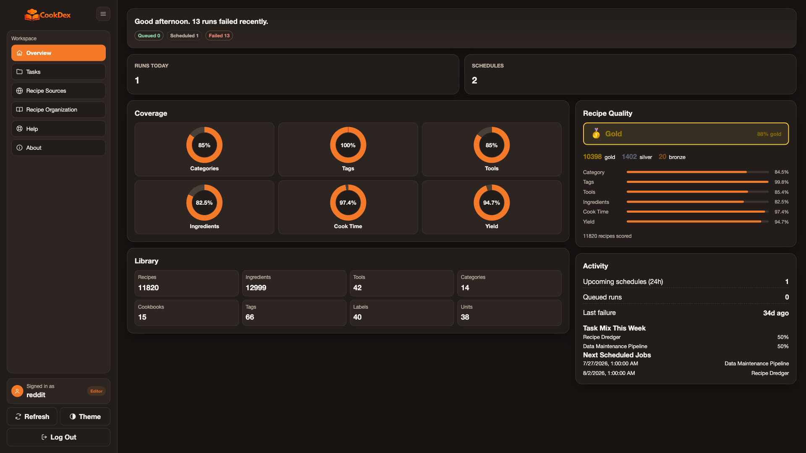
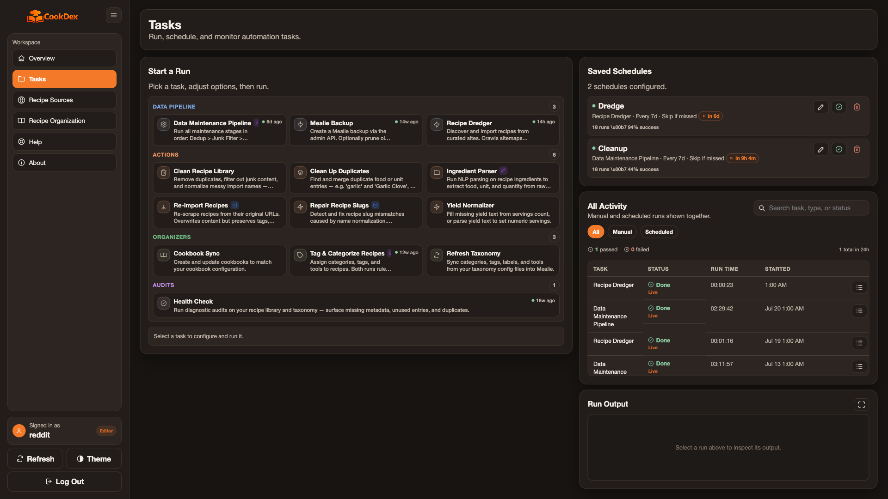
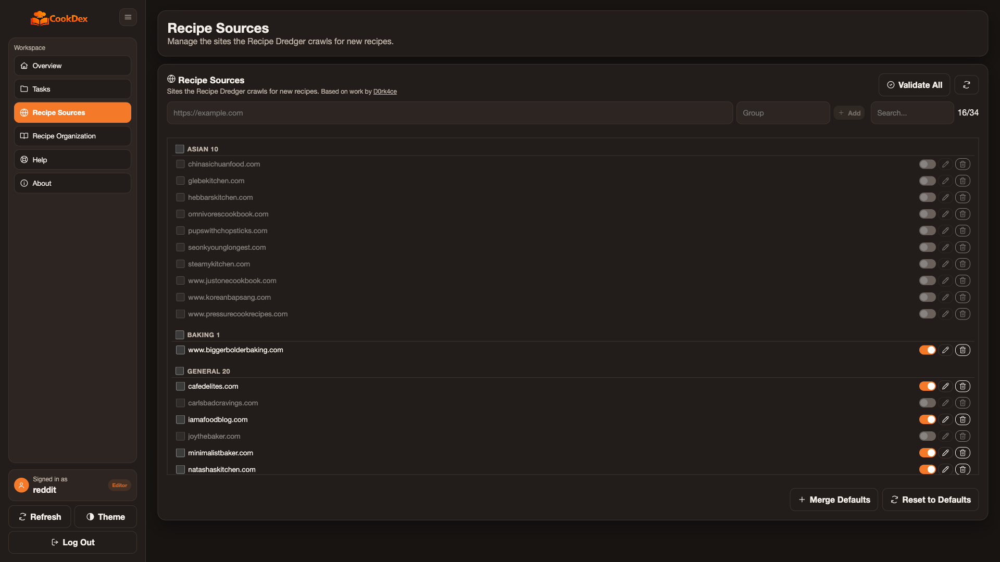
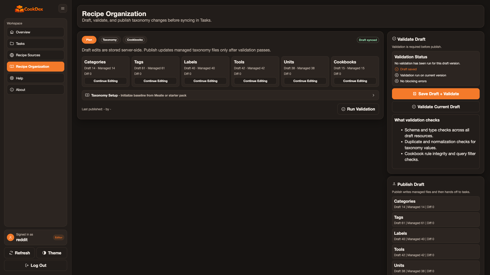
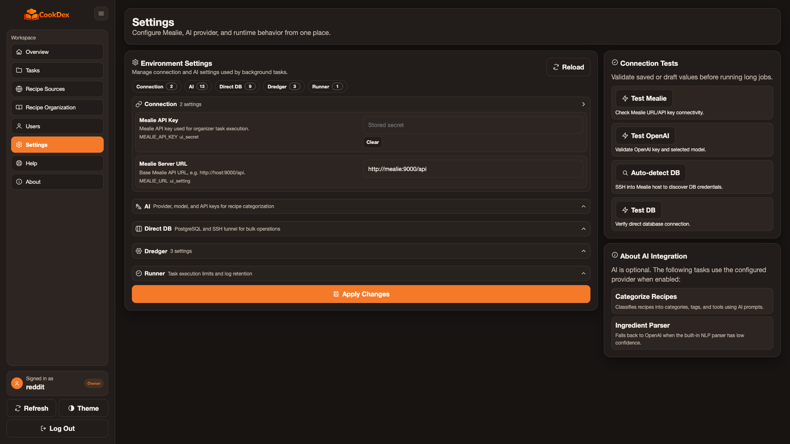

# CookDex

<p>
  
  
  
  
  
</p>

CookDex is a web UI for keeping a self-hosted [Mealie](https://mealie.io) recipe library clean, searchable, and well organized.

It helps you import recipes, clean messy scraper results, keep categories and tags consistent, schedule maintenance jobs, and review library health without living in the command line.

A clean library also makes native Mealie clients better.
[Forked](https://apps.apple.com/us/app/forked-recipes/id6760947117), also from
Knownframe, turns your recipes into swipe-based discovery, meal plans, and one
persistent shopping list.

## What It Actually Does

Recipes scraped from the web arrive with the site's SEO baggage attached. CookDex
strips it back to the recipe:

| Imported as | CookDex makes it |
|---|---|
| `instant-pot-beef-stew-recipe` | Instant Pot Beef Stew |
| `grandmas-old-fashioned-apple-pie-recipe` | Grandmas Old Fashioned Apple Pie |
| `bbq-pulled-pork-sandwiches` | BBQ Pulled Pork Sandwiches |

It also finds the entries that are not recipes at all. The junk filter sorts them
into nine categories — how-to articles, listicles, digest posts, utility pages,
placeholder instructions, failed scrapes, recipes with no ingredients, and
garbled scrapes — so you can review a category at a time instead of one recipe at
a time.

Every cleanup task previews its changes first. Nothing is written until you turn
preview off, and destructive options additionally require an owner policy unlock.



| | |
|---|---|
|  |  |
|  |  |

## Who It Is For

CookDex is for people who already run Mealie and want help with the maintenance work that builds up over time:

- Recipes imported from many sites with inconsistent names, tags, and ingredients
- Duplicate foods, units, categories, tags, labels, or tools
- Recipes that need bulk cleanup after a large import
- A taxonomy that should be edited carefully before syncing to Mealie
- A repeatable way to run backups, audits, cleanup, and organization tasks

Most tasks start in preview mode, so you can inspect what CookDex would do before allowing live changes.

## Requirements

- A running [Mealie](https://mealie.io) instance (v3.28.0 is the currently certified version) and an API token from your Mealie user profile
- Docker and Docker Compose
- Roughly 500 MB of disk for the image, plus persistent volumes for state, logs, and reports

Optional: an AI provider key (OpenAI, Anthropic, or a local Ollama) for AI-assisted
categorization, and direct Postgres access for faster bulk operations. Neither is
required — rule-based categorization and the Mealie API path work on their own.

## Quick Start

```bash
mkdir -p cookdex && cd cookdex
curl -fsSL https://raw.githubusercontent.com/thekannen/cookdex/main/compose.ghcr.yml -o compose.yaml
docker compose pull cookdex
docker compose up -d cookdex
```

Open `https://your-server:4820/cookdex`, accept the self-signed certificate warning, and create the first admin account.

No `.env` file is required for normal setup. After you create the account, CookDex asks for:

- **Mealie address**: the address you open Mealie at, such as `http://mealie:9000` (CookDex adds `/api` for you)
- **Mealie API token**: a token from your Mealie user profile

It tests the connection before saving, then scans your library.

## First Safe Run

The first scan only looks; nothing in Mealie changes. It opens on the **Library** page:

1. Check the score and the **Needs attention** list.
2. Click **Review** on a finding to see each change, untick anything you want to keep, and edit new names if you like.
3. Click the apply button when the list looks right. A Mealie backup is made first, and only the items you selected change.

**Organize** edits tags, categories, tools, cookbooks, food labels, foods and units directly in Mealie, with a backup before each batch, suggests starter sets for a new library, and imports or exports the whole taxonomy as JSON (the sections match the files in `configs/taxonomy`, so you can keep them in git). **Discover** imports new recipes from sources you switch on. **Automations** runs backups, weekly checks and imports on a schedule. Every job, with all of its options and logs, is still available under **All tools** on the Automations page.

## Recipe Dredging

Most Mealie tooling waits for you to paste a URL. CookDex can go and find recipes
for you.

Point it at a recipe site and it reads that site's `robots.txt` and sitemap to
enumerate candidate pages, then checks each one before importing anything. A page
has to actually look like a recipe — CookDex looks for `schema.org/Recipe` JSON-LD
with real ingredients and instructions, and cross-checks with
[recipe-scrapers](https://github.com/hhursev/recipe-scrapers) — so listicles and
how-to posts are rejected rather than imported and cleaned up later. Anything that
passes is handed to Mealie's own scraper.

It is built to be a polite crawler: `robots.txt` crawl-delay is honored, with a
one-second floor that configuration cannot lower. Sitemaps are cached, and URLs
already imported or rejected are skipped on later runs.

Preview mode reports what it would import without writing to Mealie or recording
any state.

## What Else You Can Do

CookDex includes workflows for:

- **Library cleanup**: remove duplicate URLs, filter junk pages, normalize names, and repair slugs
- **Ingredient parsing**: convert raw ingredient lines into structured Mealie foods, units, and quantities
- **Taxonomy editing**: draft, validate, publish, and sync categories, tags, cookbooks, labels, tools, and unit aliases, and merge near-duplicate tags and categories
- **Recipe organization**: tag and categorize recipes with rules first, then optional AI
- **Maintenance scheduling**: run tasks once or on an interval
- **Backups and audits**: create Mealie backups and track recipe quality over time

Optional AI providers can help with categorization and parser fallback. Rule-based categorization works without any AI key.

Optional Direct DB access can make large read/write jobs much faster and can repair cases that Mealie's HTTP API cannot update. The normal path still works through the Mealie API.

## Updating

```bash
docker compose pull cookdex
docker compose up -d --remove-orphans cookdex
```

Then open CookDex and confirm you can log in. You can also check:

```bash
curl -k https://localhost:4820/cookdex/api/v1/health
```

## Privacy And Safety

CookDex runs on your server and does not include telemetry or analytics.

- Credentials are stored locally and encrypted at rest.
- Session cookies are used only for authentication.
- Tasks run with a minimal environment instead of inheriting all host variables.
- Preview mode is the default for write-capable tasks.
- If AI categorization is enabled, only the recipe text needed for that task is sent to your configured provider.

## Learn More

- [Install](docs/INSTALL.md) - deployment details and volume notes
- [Getting Started](docs/GETTING_STARTED.md) - first login and first task run
- [Tasks and API](docs/TASKS.md) - task options, schedules, safety policies, and API routes
- [Data Maintenance](docs/DATA_MAINTENANCE.md) - the staged cleanup pipeline
- [Direct DB Access](docs/DIRECT_DB.md) - optional faster database-backed operations
- [Local Dev](docs/LOCAL_DEV.md) - run and test CookDex from source

## Getting Help

- Something not connecting or behaving unexpectedly? Start with the troubleshooting
  table in [Local Dev](docs/LOCAL_DEV.md#troubleshooting), which covers the common
  setup problems.
- The **Help** page inside CookDex documents every task and setting in place.
- Bugs and feature requests: [open an issue](https://github.com/thekannen/CookDex/issues).

## Contributing

CookDex is AGPL-3.0 and contributions are welcome — see [CONTRIBUTING.md](CONTRIBUTING.md).
If CookDex is useful to you, starring the repo helps other Mealie users find it.

## Support

CookDex is free and built in my spare time. If it saves you time,
[sponsoring on GitHub](https://github.com/sponsors/thekannen) helps cover hosting and the
test Mealie instance every release is checked against. One-time tips are welcome too.
